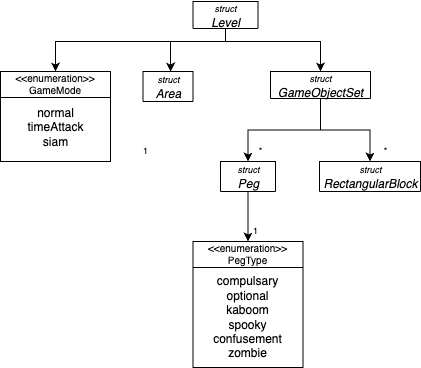
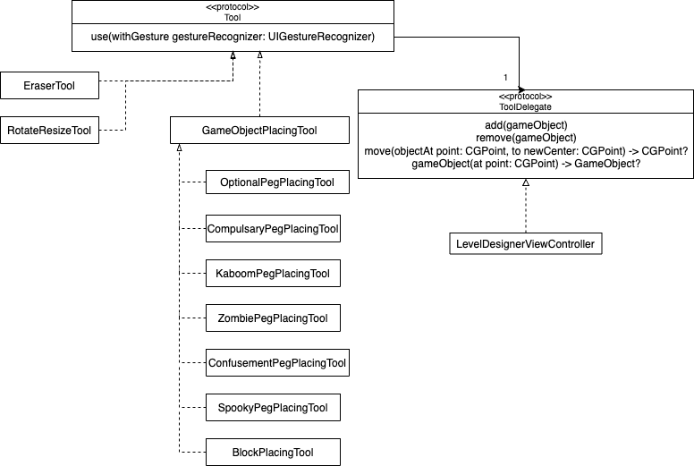
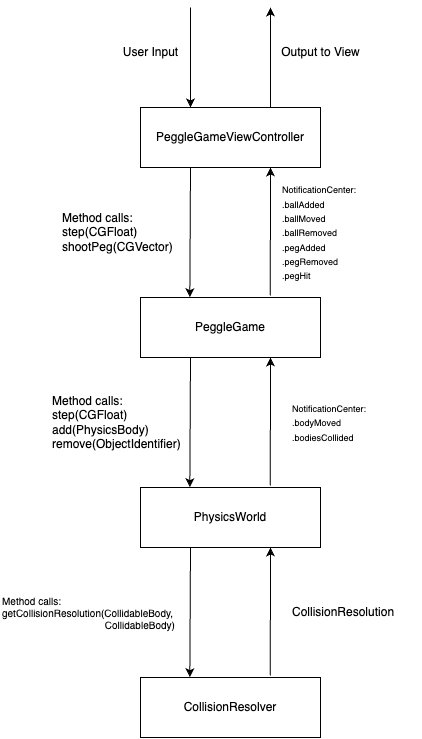
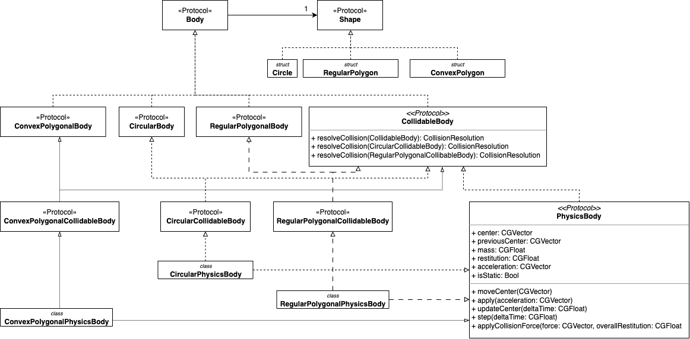
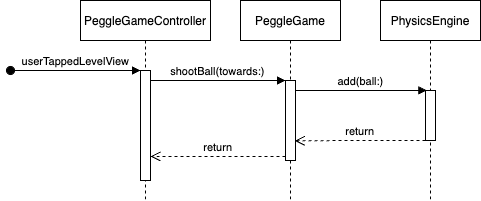

# Developer Guide (PS4)

This app uses the MVC pattern. 

The guide is split up into 2 sections, Level Designer and Peggle Game, where the PS2 and PS3 content are discussed respectively.

# Level Designer

Here, we will first discuss the model, followed by how the model interacts with the view controller and finally we will discuss the view.

The last section will be on peristence.

## Domain Logic

### An overview of the models is shown below

### Level
The `Level` struct holds the information required to represent a level in the game, with a level being defined as:
1. a GameObjectSet holding GameObjects and their positions.
2. a specified area, depending on the screen size.
3. a GameMode that the level is designed for.

### Peg
The `Peg` struct represents a circular peg in the level, containing:
1. a circle representing its shape.
2. a `PegType`.

The `PegType` enumeration consists of six values,
| Peg Type            | Colour       |
|:-------------------:|:------------:|
| OptionalPeg         | Blue         |
| CompulsaryPeg       | Orange       |
| ConfusementPeg      | Red          |
| ZombiePeg           | Yellow       |
| SpookyPeg           | Grey         |
| KaboomPeg           | Green        |

### RectangularBlock
The `RectangularBlock` has a convex polygon representing its shape.

### Area
The `Area` struct represents a rectangular area on the device's screen, defined simply with 4 bounding values for the top, bottom, left and right of the screen.

### Tool

The `Tool` protocol defines the behaviour of the tools that can be used in the Level Designer.
1. `XXXPegPlacingTool`: places a peg of type "XXX" with a tap.
3. `EraserTool`: erases pegs when tapped, long-pressed or swiped scross the screen.

To reduce coupling between `LevelDesignerViewController` and `Tool`, the delegate pattern is used. `LevelDesignerViewController` conforms to the `ToolDelegate` protocol which supports a set of actions that a `Tool` can carry out. This allows a `Tool` to be used in other situations in future.

For example,
1. When the compulsary peg placing tool is selected and a tap is registered on the screen, `handleGesture(_:)` is called in `LevelDesignerViewController`.
2. The `LevelDesignerViewController` calls `use(withGesture:)` in its `Tool`.
3. The `Tool` handles all the logic required.
4. From there, a new `Peg` is created at the position of the tap gesture and the `add(peg:)` method of the `Tool`'s `ToolDelegate` is called. In this case, the `ToolDelegate` is the earlier `LevelDesignerViewController` instance.
5. This calls the `add(peg:)` method of the `Level` instance owned by the `LevelDesignerViewController`. The logic in the `add(:peg)` method is relatively simple and will not be further elaborated on.

## Presentation Logic

### Level Designer View Controller
There are 3 main sections here:
1. Board: consists of the background image and a Level `UIView` where pegs are shown.
2. PaletteStackView: consists of the palette buttons.
3. OptionsStackView: consists of the "LOAD", "SAVE", "RESET", "START", "Back" buttons, the "Level Name" text input field and the Game Mode picker wheel.

#### Receiving Inputs From User
Gesture recognizers for tap, long-press and pan gestures are added to the level view. When the gesture is detected, responsibility is handed over to the `Tool` to make changes.

### Level Select View Controller
The level select screen is implemented with a `UITableViewController` at the moment and can be a point of further improvment in terms of aesthetics.

The delegate design pattern is used here for the `LevelSelectViewController` to tell the `LevelDesignerViewController` which level to load.

For example,
1. When the "LOAD" button is clicked, the `LevelDesignerViewController` performs a segue to the `LevelSelectViewController`
2. When the user selects a level to load, the `tableView(_:didSelectRowAt)` method is called, which calls the `LevelSelectViewController`'s `LevelSelectDelegate`'s `loadLevel(levelName:)` method. In this case, the `LevelSelectDelegate` is the earlier instance of `LevelDesignerViewController`.
3. The `LevelDesignerViewController` then calls its `LevelDesigner`'s `loadLevel(LevelName:with:)` method. The remaining logic for loading level will be elaborated on in the [persistence](#persistence) section.

## Persistence
CoreData was used for persistence. In this app, the types that require storage are all structs since inheritance is not needed and structs are more computationally and memory efficient than classes. This means that there would be an extra step of "encoding" the struct into a class to be saved with Core Data and "decoding" the objects fetched from Core Data back into the structs used in the app.

Below is a table of structs that need to be stored and their respective object representations in Core Data:
| Struct to be stored | Object name in Core Data |
|:-------------------:|:------------------------:|
| Peg                 | PegData                  |
| PegType             | PegTypeData              |
| CGPoint             | CGPointData              |
| CGVector            | CGVectorData             |
| Level               | LevelData                |
| Area                | AreaData                 |
| RectangularBlock    | RectangularBlockData     |

There is thus a need for the stored structs to conform to the `ToDataAble` and `FromDataAble` procotols, which specify that the conforming type must have a `toData(context:)` method that converts itself to an instance of its respective `___Data` object and an initalizer that takes in its respective `___Data` object to initialise the struct.

This is, however still justifiable as saving and loading are actions that occur much less frequently than the addition and removal of pegs, so the tradeoff is essentially a faster app all-round in exchange for a barely noticable increase in save and load times.

### CoreDataManager
The `CoreDataManager` class was created for the following reasons:
1. Separate persistence logic from the AppDelegate.
2. Having a class to manage saving and fetching data instead of putting that logic in the view controllers.

The `CoreDataManager` manages fetching and saving of `LevelData` objects. Additionally, in the case where a user tries to save a level under the same name as a level that already exists, the `CoreDataManager.saveLevelData(level:overwrite)` method throws an error to the view controller, which then asks the user if they would like to overwrite the previously saved data. If the user chooses to do so, the same method is called again with `overwrite` set to `true`.

# Peggle Game

The model is split up into 3 main components:
1. PeggleEngine: the game engine for Peggle
2. PhysicsEngine: the physics engine
3. CollisionResolver: the collision detector and resolver

This guide will discuss the components from the bottom up.

## Shapes and Bodies
The diagram below shows the types that will be used in the diffrent components.

**Note**: the different dotted lines all mean the same thing (i.e. conforms to procotol). They are merely used to prevent confusion at points where they cross each other.

### Shape
* `Shape` is a protocol that will be used as a representation of the shape of different bodies used in the game.
* `Circle`, `RegularPolygon`, and `ConvexPolygon` are the ones currently implemented.
* To introduce any bodies with a shape that cannot be represented by these, start by creating its shape representation here.

### Body
* `Body` represents the concept of a body in the physical world.
* A `Body` must have a `Shape`.
* `CircularBody`, `RegularPolygonalBody` and `ConvexPolygonalBody` conform to `Body` and have the respective shapes as their `internalShape`.

### CollidableBody
* `CollidableBody` represents a type of body that can collide with other `CollidableBody`s. `CircularCollidableBody`, `RegularPolygonalCollidableBody` and `ConvexPolygonalCollidableBody` provide protocol type names that can be used to handle collisions between `CollidableBody`s of those shapes.
* There is a need to have this as a separate abstraction as games often have intangible objects that regular objects do not collide with.
* Additionally, this allows the code for `CollidableBody` to be re-used to better implement collision detection for the level designer, although this has not been done for this problem set (might be a future improvement).

Every body that can have collisions must conform to this protocol. To allow for the ability to collide with other `CollidableBody`s of different shape, double dispatch is used, so the following methods are required:
* `resolveCollision(CollidableBody): CollisionResolution`
* `resolveCollision(CircularCollidableBody): CollisionResolution`
* `resolveCollision(RegularPolygonalCollibableBody): CollisionResolution`
* `resolveCollision(ConvexPolygonalCollibableBody): CollisionResolution`

*Side note*: At every collision, there is a need to return the force vectors for both bodies in the collision. The use of double dispatch adds a layer of confusion as the order of the `CollidableBody`s are flipped up to 2 times. `CollisionResolution` handles this with a `flipped()` method. Whenever a `resolveCollision` method flips the order of the `CollidableBody`s, it should also flip the order of the `CollisionResolution` that it receives so as to maintain the correct order when returned to the caller.

### PhysicsBody
* `PhysicsBody` represents a body in the physical world that follows the laws of physics. 
* `PhysicsBody`s have an `updateCenter(deltaTime)` method that uses the Verlet Integration equation to simulate kinematics.
* The `CircularPhysicsBody`, `RegularPolygonalPhysicsBody` and `ConvexPolygonalPhysicsBody` classes are concrete implementations of `PhysicsBody`.
* `CircularPhysicsBody` is used to model Pegs and Balls while `ConvexPolygonalPhysicsBody` is used to model the walls and blocks and can possibly be used to introduce new Peg/Ball shapes.

## CollisionResolver
* `CollisionResolver` contains methods to detect and resolve the collisions between `CollidableBody`s.
* All `resolveCollision` methods in `CollidableBody`s will lead to one of the method calls in this class.

*Note*: I will use the words 'Circle', 'RegularPolygon' and 'ConvexPolygon' in the descriptions below for simplicity, but I actually mean `CircularCollidableBody`, `RegularPolygonalColliableBody` and `ConvexPolygonalCollidableBody` respectively.

### Circle-Circle collisions
* Checking for collisions is rather simple, all we need to do is check if the euclidean distance between the center of the two circles is smaller than the sum of their radii.
* As for resolving collisions, both circles are pushed in opposite directions along the vector connecting their two centers.

### RegularPolygon-RegularPolygon collisions
* The Separating Axis Theorem is used here. Since this is a well-known solution, I shall not discuss how collisions are detected.
* In order to resolve collisions, for every axis tested in the collision detection portion, we keep track of the depth of collision and the vector along which the collision is occuring. The bodies are then pushed along the direction with the smallest collision depth.

### ConvexPolygon-ConvexPolygon collisions
* The same as RegularPolygon-RegularPolygon collisions

### Circle-RegularPolygon collisions
* This is very similar to Polygon-Polygon collisions, except that we only check all the axes of the polygon, since the circle's extreme points are the exact same along every axis.

### Circle-ConvexPolygon collisions
* The same as Circle-ConvexPolygon collisions

### ConvexPolygon-RegularPolygon collisions
* The same as RegualarPolygon-RegularPolygon collisions

## PhysicsEngine
* The PhysicsEngine consists of a `PhysicsWorld`. The `PhysicsWorld` manages a collection of `PhysicsBody`s.
* It has a `step(deltaTime)` method that is called by an external comonent to progress the `PhysicsWorld` forward by one time step.
  * In each step, every `PhysicsBody`'s `step(deltaTime)` method is called
  * Then, the `PhysicsWorld` loops through all its `PhysicsBody`s and checks every pair for a collision, then resolves them if there is a collision.
* The [Verlet Integration equation](https://www.algorithm-archive.org/contents/verlet_integration/verlet_integration.html) was used here.
  * The advantages if this is that velocity no longer needs to be tracked and there are fewer steps required to obtain the next position of the `PhysicsObject`. This is very likely to be advantageous especially since the Physics Engine is constantly looping many times a second and a few less multiplication operations per object will likely allow more objects to exist in the Physics Engine before performance begins to take a noticable hit.
  * The disadvantages of this design choice is the assumption that each `deltaTime` is exactly the same. While `deltaTime` values from `CADisplayLink` are not necessarily always the same, the differences are so small that Physics Engine does not appear to suffer from any significant issues.
  
## PeggleEngine
* In the PeggleEngine, there is a `PeggleGame` which provides a method to shoot a ball in a specified direction.
* This is also where most of the new game features are implemented.

## Communication Within Components

Communication from one component to the component **below** it is through method calls such as the following example.

When the user taps the screen, the `PeggleGame`'s `shootBall(towards:)` method is called, and it subsequently adds a `CircularPhysicsBody` to its `PhysicsWorld`.
  
As for communication from a component to a component **above** it, the `NotificationCenter` is used to implement an observer pattern.

For example, each time a `PhysicsBody`'s position is updated in the `PhysicsWorld`, a notification is posted to the `.bodyMoved` name, containing information about which body was moved and how it was moved. On the receiving end, the `PeggleGame` subscribes to the `.bodyMoved` notification and has a callback method `ballMoved(_:)` which moves its own representation of the ball, then sends a `.ballMoved` notification to the `PeggleGameViewController`. Finally, the `PeggleGameViewController`'s `moveBallView(_:)` callback method calls `ballViewRenderer.moveBallView(ball:)` to update the position of the `BallView` on the screen.

## Utils

There were a few additional utility components created to help with the implementation of the Model.

### TrackedSet
A `TrackedSet` behaves essentially the same was as a `Set`, except each operation on it is tracked as a `TrackedSetChange` and each change can be retrived. The purpose of this is up improve the performance of the `LevelDesignerViewController` to only update the views that have been changed, instead of removing all views and inserting all of them again.

### AxisSet
In the implementation of the Separating Axis theorem, there is a need to iterate through all possible axes of the colliding shapes and many times, these axes could be the same. In order to prevent repeat calculations for duplicate axes, the `AxisSet` was created to behave similar to a `Set`, except all inserted `CGVector`s are unit vectors and any `CGVector`s parallel to any other `CGVector` existing in the set are considered duplicates and not inserted.
